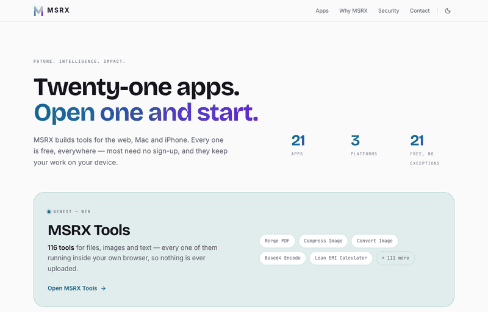

# MSRX Portal

**[www.msrx.co.in](https://www.msrx.co.in)** — the catalog for everything I've shipped: 21 apps across the web, macOS and iOS.

All of them are free, everywhere. No paid tier, no subscription, no trial that expires. Eleven of the twelve web apps don't ask for an account either.



## What it is

A catalog site, not a product site. It has one job: let someone find the app that does the thing they need, and get out of the way. Each app gets its own page with what it does, where it runs, and a link straight to it.

| Platform | Apps |
|---|---|
| Web | 12 |
| macOS | 6 |
| iOS | 4 |

Those add to 22 because one app ships on both the web and the Mac. It has a single catalog entry; the second platform is *derived* from the presence of a Mac App Store link rather than typed twice.

## The one idea worth stealing

`lib/apps.ts` is the single source of truth, and nothing downstream is allowed to restate what it knows.

Counts, platform tags, the "newest app" callout, the sitemap, `llms.txt`, the structured data and the OG images are all computed from that one array. No page contains a hand-written number. This isn't tidiness — a count typed into a paragraph has nothing that fails when the data moves, so it quietly becomes a lie and stays one. The `llms.txt` file had already drifted three apps out of date before it was generated instead of written.

The same rule applies to platforms: `platformsOf()` derives the list, so an app cannot appear on the Mac page and be missing its Mac tag.

## Design

Light by default, with a dark toggle. Theme is set by an inline script before paint, so there is no flash of the wrong theme on load.

Contrast was **measured in the browser**, not calculated from hex values. That caught two genuine WCAG AA failures that arithmetic had passed — the tightest surface an element can land on is the one that decides, and for hover states that isn't the background you designed against.

## Stack

Next.js 16 · React 19 · TypeScript · Tailwind v4 · lucide-react. Static export.

## Running it

```bash
npm install
npm run dev
```

`npm run build` also typechecks, and is the gate to use — `tsc --noEmit` hangs in this project.

## Licence

No licence is granted. The source is public to read, not to redistribute.
